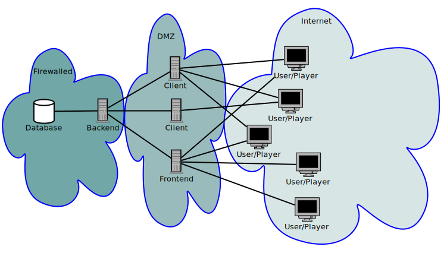

# Setting up the system

The Backend needs to be running, the Frontend is optional.

Due to the lack of security with plain HTTP access between the Backend and the Clients, it is highly recommended to keep the Backend behind a firewall and not allow access to it from the internet. The Clients and the Frontend should therefore be placed in a DMZ from where they have access to the Backend.

It is not necessary to provide access to the Frontend from the internet, the Users do not need to use the Frontend for "normal" operations.



However, most users are probably not able to keep the Backend behind a firewall and have the Clients communicate internally, but instead run the Backend in the internet. In this scenario, it is highly recommended that the access to the Backends port is restricted to only to the Clients and the Frontend.


## Configuration

Create a file named ".env" into the backend root directory, and adjust the Backend configuration in this file. The format is:
VARIABLE1=Value1
VARIABLE2=Value2
...

Below are listed all the variables:
<table>
  <tr><th>Variable</th><th>Type</th>   <th>Default value</th><th>Description</th></tr>
  <tr><td>PORT</td>    <td>Integer</td><td>3001</td>         <td>The IP port the Backend listens to.</td></tr>
  <tr><td>PROTOCOL</td><td>String</td> <td>"http"</td>       <td>Either "http" or "https". Note that HTTPS require valid certificate, self-signed will not work.</td></tr>
  <tr><td>CERT</td>    <td>String</td> <td>"cert.pem"</td>   <td>The filename of the certificate used for HTTPS.</td>
  <tr><td>CERT_KEY</td><td>String</td> <td>"key.pem"</td>    <td>The filename of the certificate key used for HTTPS.</td>
</table>


## Installing dependencies

Both the Backend and the Frontend use npm, thus instaling the dependencies is done by issuing:
```
$ npm install
```
In the respective directory (backend and frontend).


## Starting the Backend

Use the following npm command to start the Backend normally:
```
$ npm start
```


## Client (Ark game server) configuration

Point all Clients (Ark game servers) to the Backend by setting the following GameUserSettings.ini -options:
```
[StructureSaver]
Backend="http://localhost:3001"
BackendClientId="id"
BackendClientPassword="password"
```

Each Client must have unique `BackendClientId`. The ClientIds would normally be created in the Frontend, but the Frontend is currently not ready, so the supplied test script `bin/post.js` can be used to generate them as well. For each Client, edit the `backend/test_requests/clientCreate.json` file, setting the "client_id" and "password" fields appropriately, then execute it:
```
$ ./bin/post.js backend/test_requests/clientCreate.json
```
Note that the Backend must be running, and you probably need to edit the `bin/post.js` script, adjust the `hostname` and `port` options to point to your Backend.
